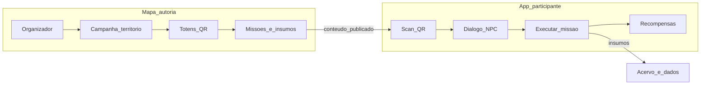
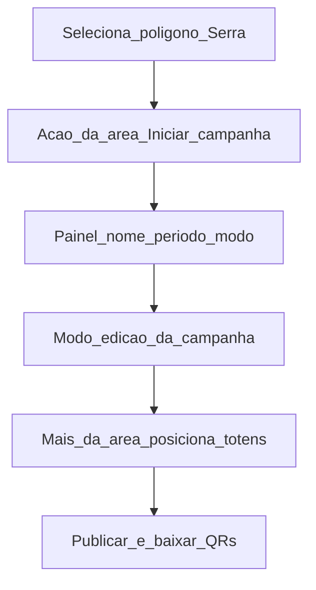
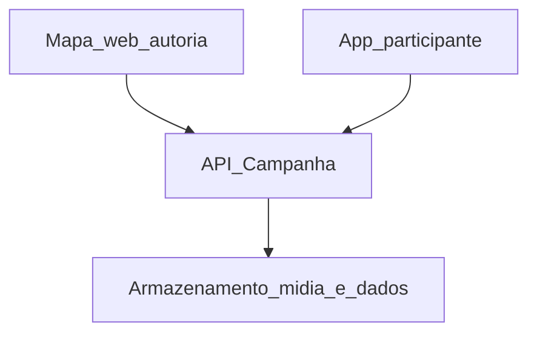

# Campanha Figital — Regras de Negócio, Casos de Uso e Especificação Técnica

**Plataforma:** Território (territorio.ai)
**Tipo:** Feature nova (campanha físico-digital) sobre o Mapa
**Versão do documento:** 1.1
**Data:** 10/09/2026
**Escopo:** Produto planejado — **não** descreve o estado atual da POC

> A interface que existe hoje está em [`DOCUMENTACAO_ATUAL.md`](DOCUMENTACAO_ATUAL.md). Este arquivo é o plano da campanha **Figital**: regras, fluxo, casos de uso e a divisão entre **mapa** (autoria) e **aplicativo** (participação). Não trate `Documentacao_Regras_de_Negocio_Mapa.md` nem este arquivo como estado atual.

---

## Sumário

**Parte 1 — Negócio**

1. [Como funciona](#1-como-funciona)
2. [Papéis](#2-papéis)
3. [Objetos de negócio](#3-objetos-de-negócio)
4. [Como iniciar uma campanha no mapa](#4-como-iniciar-uma-campanha-no-mapa)
5. [Fluxo principal](#5-fluxo-principal)
6. [Regras de negócio](#6-regras-de-negócio)
7. [Casos de uso](#7-casos-de-uso)
8. [Roteiro: Serra do Vulcão](#8-roteiro-serra-do-vulcão)
9. [Matriz de permissões](#9-matriz-de-permissões)

**Parte 2 — Técnica**

10. [Dois produtos, um contrato](#10-dois-produtos-um-contrato)
11. [Mapa — autoria e operação](#11-mapa--autoria-e-operação)
12. [Aplicativo — jornada do participante](#12-aplicativo--jornada-do-participante)
13. [Arquitetura e API conceitual](#13-arquitetura-e-api-conceitual)
14. [QR, NPC e offline](#14-qr-npc-e-offline)
15. [Schema de insumos](#15-schema-de-insumos)
16. [Dados gerados para a instituição](#16-dados-gerados-para-a-instituição)
17. [Glossário](#17-glossário)
18. [Questões em aberto](#18-questões-em-aberto)

---

# Parte 1 — Negócio, fluxo e regras

## 1. Como funciona

Duas superfícies, um contrato. A instituição **desenha** a campanha no mapa (área, totens, missões, recompensas); a pessoa **participa** no campo (escaneia o QR do totem, conversa com o NPC, cumpre missões e deixa insumos). Os insumos voltam para a instituição como acervo e evidência da ação comunitária.

### 1.1. O que a campanha usa do mapa

O Figital **não substitui** missões, mutirões e memórias do mapa. Ele **usa** esses conceitos numa jornada presencial ordenada:

| Já previsto no mapa | O que o Figital acrescenta |
|---------------------|----------------------------|
| Polígono / trilha (área) | Território oficial da campanha |
| Missão com localização | Missão de totem, com NPC, ordem e insumo configurável |
| Marcador | Totem físico + QR |
| Memória | Um dos tipos possíveis de insumo |
| Estrelas / insígnias (planejadas) | Recompensa parcial por totem e recompensa final da trilha |

### 1.2. Fluxo em uma imagem



---

## 2. Papéis

| Papel | Onde atua | Descrição |
|-------|-----------|-----------|
| **Organizador** | Mapa | Pessoa ou organização dona do mapa (Owner) ou Editor. Cria a campanha, posiciona totens, publica, lê insumos. |
| **Operador de campo** | Mapa (leitura) e território físico | Instala totens e testa QRs; não altera regras da campanha salvo permissão de Editor. |
| **Participante** | Aplicativo | Pessoa na trilha. Não precisa ser colaboradora do mapa. Inicia jornada no QR de entrada. |
| **NPC** | Aplicativo | Persona guiada (texto, áudio ou avatar). Não é um usuário. Explica missões, recompensas e o próximo passo. |

> [!IMPORTANT]
> **Colaborador do mapa ≠ participante da campanha.** Quem edita o território no mapa não é, por isso, quem caminha a trilha. Quem caminha a trilha não ganha permissão de editar o mapa.

---

## 3. Objetos de negócio

### 3.1. Campanha Figital

Uma **campanha** pertence a **exatamente um mapa**. Tem nome, período (início e fim), território (área), totens, recompensa final, texto de consentimento dos insumos e modo de progresso (`sequencial` ou `livre`).

Status da campanha:

```
RASCUNHO ──► PUBLICADA ──► ENCERRADA
                 │
                 └──► PAUSADA ──► PUBLICADA
```

### 3.2. Território

Polígono ou linha (trilha) já desenhável no mapa. Todos os totens de uma campanha devem estar **dentro** dessa geometria (ou sobre a linha, no caso de trilha).

### 3.3. Totem

Ponto físico no território. Cada totem tem:

- Coordenada no mapa
- Papel: `inicio`, `intermediario` ou `fim`
- QR (URL profunda do app)
- Missão associada (obrigatória nos intermediários e no fim; o de início pode só abrir a jornada)
- Roteiro do NPC naquele ponto

### 3.4. Missão de campanha

Missão do mapa **especializada** para o Figital: instrução do NPC, ordem, recompensa parcial e **catálogo de insumos** (quais evidências o participante deve entregar). Uma missão pode exigir um ou mais tipos de insumo.

### 3.5. Jornada

Sessão de um participante numa campanha, criada no scan do totem de **início**. Guarda progresso, rascunhos offline e recompensas já liberadas.

Status da jornada:

```
INICIADA ──► EM_ANDAMENTO ──► CONCLUIDA
     │              │
     └──────────────┴──► ABANDONADA (inatividade ou campanha encerrada)
```

### 3.6. Recompensa

- **Parcial:** por missão/totem concluído (insígnia pequena, XP, item de coleção).
- **Final:** só com todas as missões **obrigatórias** concluídas. Não é substituída pelo conjunto das parciais.

### 3.7. Insumo

Evidência que o participante gera na missão. Os tipos **não são fixos na campanha**: cada missão escolhe no catálogo (foto, vídeo, áudio, texto, GPS/check-in, formulário, memória no mapa). Ver [§15](#15-schema-de-insumos).

---

## 4. Como iniciar uma campanha no mapa

Esta seção responde direto à pergunta prática: *quero iniciar uma campanha na Serra do Vulcão — como faço?* A resposta curta: **a campanha começa a partir da própria área desenhada no mapa**, não de um botão solto na toolbar.

### 4.1. Onde fica o gatilho

Hoje, ao selecionar um polígono ou trilha, o mapa já mostra as **ações da forma** no canto (adicionar dentro, editar, excluir — ver [`poc/client/index.html`](../poc/client/index.html), bloco `shape-actions`). O Figital acrescenta ali uma ação de campanha.

**Por que na forma e não em “Novo marcador”:** uma campanha **não é um pino** — ela **toma a área inteira** (um território por campanha, [RN-FIG-002](#61-campanha-e-território)). Colocá-la no mesmo menu de Missão/Marcador misturaria dois modelos mentais: “ponto dentro da área” vs. “a área vira campanha”. Por isso, iniciar campanha é uma **ação da área selecionada**.

Depois que a campanha existe, o **“+” da área** (que hoje adiciona missão/marcador) passa a posicionar **totens** dentro da geometria, reaproveitando a regra de “só dentro da forma”.

### 4.2. Caminho principal — território primeiro (o da Serra do Vulcão)

Este é o caminho quando a área já está desenhada no mapa.



1. Owner/Editor seleciona o polígono **Serra do Vulcão**.
2. Nas ações da forma aparece **Iniciar campanha** (junto de editar/excluir).
3. Abre o painel da campanha: **nome**, **período**, **modo** (sequencial/livre) → grava como **rascunho**.
4. O mapa entra em **modo de edição da campanha**: o território fica destacado e o painel da campanha assume; os totens ainda estão vazios.
5. O **“+” da área** agora posiciona **totens** (início / intermediário / fim), cada um com missão, insumos, roteiro do NPC e recompensa parcial.
6. Definidos a recompensa final e o consentimento, o organizador **publica** e baixa as artes de QR.

### 4.3. Caminho secundário — intenção primeiro

Para quem ainda **não** tem a Serra desenhada, ou prefere começar pela intenção:

1. Abre a lista **Campanhas** do mapa → **Nova campanha**.
2. Escolhe uma **área existente** ou **desenha** o polígono/trilha ali no mesmo fluxo.
3. Segue igual ao caminho principal a partir do passo 3 (nome, período, modo → rascunho).

Os dois caminhos chegam ao mesmo estado: uma campanha em rascunho amarrada a **um** território.

### 4.4. Estados da ação na área

O rótulo da ação muda conforme a situação do território selecionado:

| Situação do território | Ação exibida | Regra |
|------------------------|--------------|-------|
| Sem campanha | **Iniciar campanha** | Só Owner/Editor ([RN-FIG-042](#61-campanha-e-território)) |
| Campanha em rascunho ou pausada | **Continuar campanha** | Abre o modo de edição |
| Já existe campanha **PUBLICADA** neste território | **Ver campanha** | Uma publicada por território ([RN-FIG-008](#61-campanha-e-território)) |
| Visualizador do mapa | Ação de iniciar **não** aparece | Vê a campanha publicada se a visibilidade permitir |

---

## 5. Fluxo principal

### 5.1. Lado da instituição (mapa)

1. Demarca a área (ex.: Serra do Vulcão).
2. Cria a campanha Figital vinculada a essa área (ver [§4](#4-como-iniciar-uma-campanha-no-mapa)).
3. Posiciona totens **dentro** da área; define início, intermediários e fim.
4. Em cada totem: missão, insumos, roteiro do NPC, recompensa parcial.
5. Define a recompensa final e o texto de consentimento.
6. Gera as artes de QR, instala os totens físicos, **publica** a campanha.

### 5.2. Lado da pessoa (aplicativo)

1. Chega ao totem de início e escaneia o QR.
2. Aceita o consentimento dos insumos (se ainda não tiver nesta campanha).
3. O NPC apresenta a trilha, as missões e a recompensa final.
4. Em cada totem seguinte: scan (QR obrigatório), NPC daquele ponto, execução da missão, envio do insumo, recompensa parcial.
5. No totem de fim (ou ao completar a última missão obrigatória): recompensa final.
6. Os insumos ficam disponíveis para a instituição no painel da campanha.

---

## 6. Regras de negócio

### 6.1. Campanha e território

| Regra | Descrição |
|-------|-----------|
| **RN-FIG-001** | Uma campanha Figital pertence a **exatamente um mapa** |
| **RN-FIG-002** | Uma campanha tem **exatamente um território** (polígono ou trilha) |
| **RN-FIG-003** | Só **Owner** e **Editor** do mapa podem criar, editar, publicar, pausar ou encerrar campanha |
| **RN-FIG-004** | Campos obrigatórios na criação: **nome**, **território**, **período** (início e fim), **modo de progresso** |
| **RN-FIG-005** | O nome da campanha tem no máximo **120 caracteres** |
| **RN-FIG-006** | Campanha em **rascunho** não aceita jornada; QRs de rascunho, se testados, só funcionam para Owner/Editor |
| **RN-FIG-007** | Campanha **pausada** ou **encerrada** não inicia jornada nova; jornadas em andamento de campanha encerrada passam a `ABANDONADA` |
| **RN-FIG-008** | Um mapa pode ter **várias** campanhas, mas no máximo **uma PUBLICADA** por território ao mesmo tempo |
| **RN-FIG-041** | Toda campanha nasce **amarrada a um território**: ou uma área/trilha já existente, ou uma desenhada no mesmo fluxo de criação. **Não existe campanha sem geometria** |
| **RN-FIG-042** | **Iniciar campanha** é uma **ação da forma (área/trilha) selecionada** no mapa, disponível só para **Owner/Editor** |
| **RN-FIG-043** | Depois de criada, os **totens** entram pelo **“+” da área** (dentro da geometria), não pelo “Novo marcador” solto no mapa — evita totem fora do território |
| **RN-FIG-044** | A ação na área muda de rótulo conforme o estado: **Iniciar** (sem campanha), **Continuar** (rascunho/pausada) ou **Ver** (publicada) — ver [§4.4](#44-estados-da-ação-na-área) |

### 6.2. Totens e QR

| Regra | Descrição |
|-------|-----------|
| **RN-FIG-009** | Toda campanha tem **exatamente um** totem com papel `inicio` |
| **RN-FIG-010** | Toda campanha tem **pelo menos um** totem que não seja só de início (intermediário e/ou fim) |
| **RN-FIG-011** | Totens devem estar **dentro** do território (ou sobre a trilha, com tolerância de posicionamento definida na publicação) |
| **RN-FIG-012** | Cada totem tem um QR único, apontando para URL profunda do app daquela campanha e daquele totem |
| **RN-FIG-013** | A jornada **só começa** no QR do totem `inicio` |
| **RN-FIG-014** | QR de totem intermediário ou de fim **sem jornada** não executa missão: informa que é preciso começar no totem inicial (e, se o GPS permitir, indica a direção) |
| **RN-FIG-015** | Check-in no totem exige **scan do QR**. GPS é validação **opcional** por missão (trilha com sinal fraco não pode bloquear o piloto) |
| **RN-FIG-016** | QRs levam payload **assinado** para reduzir totens falsos (impressos por terceiros) |

### 6.3. Missões e progresso

| Regra | Descrição |
|-------|-----------|
| **RN-FIG-017** | O modo de progresso é **sequencial** ou **livre**, definido na campanha. O exemplo Serra do Vulcão usa **sequencial** |
| **RN-FIG-018** | Em modo sequencial, a missão N só abre depois da missão N−1 **obrigatória** concluída |
| **RN-FIG-019** | Missões podem ser marcadas como **obrigatórias** ou **opcionais**. Só as obrigatórias contam para a recompensa final |
| **RN-FIG-020** | Concluir uma missão exige entregar **todos** os insumos obrigatórios daquela missão, com a validação mínima de cada tipo |
| **RN-FIG-021** | Uma missão de campanha pertence a **exatamente um totem** |
| **RN-FIG-022** | Owner/Editor podem alterar conteúdo de missão em campanha publicada; jornadas já passadas daquele totem **não são reabertas** |

### 6.4. Jornada do participante

| Regra | Descrição |
|-------|-----------|
| **RN-FIG-023** | Um participante tem **no máximo uma jornada ativa** por campanha |
| **RN-FIG-024** | Recomeçar a mesma campanha (nova jornada) só é permitido se a campanha estiver publicada, a jornada anterior estiver `CONCLUIDA` ou `ABANDONADA` e o organizador **permitir replay** |
| **RN-FIG-025** | Identidade do participante no piloto pode ser **conta Território** ou **jornada anônima** (ver [§18](#18-questões-em-aberto)). Anônimo ainda gera um identificador de dispositivo/sessão para progresso e anti-abuso |
| **RN-FIG-026** | Sem rede, o app guarda rascunho local (progresso + insumos) e envia ao reconectar |
| **RN-FIG-027** | Jornada sem atividade pelo prazo configurado pelo organizador (padrão **7 dias**) pode ser marcada `ABANDONADA` |

### 6.5. Recompensas

| Regra | Descrição |
|-------|-----------|
| **RN-FIG-028** | Recompensa **parcial** é liberada no instante em que a missão daquele totem é concluída (insumos validados ou aceitos na fila offline) |
| **RN-FIG-029** | Recompensa **final** só é liberada com **todas as missões obrigatórias** concluídas |
| **RN-FIG-030** | O conjunto das parciais **não substitui** a recompensa final |
| **RN-FIG-031** | Recompensas são da **jornada/participante**, não do mapa. Podem aparecer depois como insígnia de perfil, se a plataforma de insígnias estiver ativa |

### 6.6. Insumos, consentimento e uso

| Regra | Descrição |
|-------|-----------|
| **RN-FIG-032** | Os tipos de insumo são um **catálogo**. Cada missão escolhe quais usa e quais são obrigatórios |
| **RN-FIG-033** | Antes do primeiro envio de insumo na campanha, o participante vê a finalidade e aceita (pesquisa, acervo interno, publicação no mapa) |
| **RN-FIG-034** | Recusar o consentimento **impede iniciar** a jornada se a campanha coleta qualquer insumo pessoal |
| **RN-FIG-035** | Insumo com visibilidade `mapa_publico` vira memória (ou elemento equivalente) no mapa da campanha, sujeito à moderação do organizador se essa opção estiver ligada |
| **RN-FIG-036** | Insumo com visibilidade `interno` só aparece no painel da instituição |
| **RN-FIG-037** | O participante pode solicitar exclusão dos próprios insumos; o organizador cumpre o pedido no prazo legal vigente (detalhe jurídico em aberto) |

### 6.7. Escopo e limites da campanha

Estas regras fixam o que a campanha do piloto deliberadamente **não** faz, para evitar expectativa errada durante a autoria:

| Regra | Descrição |
|-------|-----------|
| **RN-FIG-045** | A trilha **não se completa remotamente**: sem check-in por scan de QR no território, a missão não fecha (GPS é reforço opcional, [RN-FIG-015](#62-totens-e-qr)) |
| **RN-FIG-046** | O participante **não cria nem edita** campanha, território, totens ou missões pelo app — autoria é só no mapa |
| **RN-FIG-047** | No piloto o NPC é um **roteiro fixo por totem**, não um chatbot livre; IA generativa fica como evolução (ver [§14.2](#142-npc-piloto)) |

### 6.8. Relação com missões e memórias do mapa

| Regra | Descrição |
|-------|-----------|
| **RN-FIG-038** | Missão de campanha **é** uma missão do mapa (mesma entidade, campos extras Figital) |
| **RN-FIG-039** | Mutirão **não** é obrigatório no Figital. Pode ser vinculado depois (ex.: mutirão de plantio no fim da trilha) — fora do MVP Figital |
| **RN-FIG-040** | Memória pode ser um tipo de insumo; se escolhida, herda geolocalização do totem |

---

## 7. Casos de uso

### UC-01 — Iniciar campanha a partir da área no mapa

| | |
|--|--|
| **Ator** | Organizador (Owner/Editor) |
| **Pré-condição** | Mapa existente; território (área ou trilha) desenhado ou a desenhar |
| **Fluxo** | Seleciona o polígono/trilha → nas ações da forma escolhe **Iniciar campanha** → nome, período, modo de progresso → grava rascunho e entra no modo de edição da campanha. (Sem área pronta: **Campanhas → Nova campanha → desenhar/escolher território**, ver [§4.3](#43-caminho-secundário--intenção-primeiro)) |
| **Pós-condição** | Campanha `RASCUNHO` amarrada a um território, sem QRs públicos |
| **Exceções** | Território já com outra campanha publicada ([RN-FIG-008](#61-campanha-e-território)); usuário sem papel Owner/Editor não vê a ação ([RN-FIG-042](#61-campanha-e-território)) |

### UC-02 — Configurar totem, QR e missão

| | |
|--|--|
| **Ator** | Organizador |
| **Pré-condição** | Campanha em rascunho ou pausada |
| **Fluxo** | Pelo **“+” da área**, posiciona totem dentro da geometria → papel (início/intermediário/fim) → missão, insumos, NPC, recompensa parcial → gera QR |
| **Pós-condição** | Totem com URL profunda e arte de QR para download |
| **Exceções** | Ponto fora do território; campanha sem totem de início na publicação |

### UC-03 — Publicar / encerrar campanha

| | |
|--|--|
| **Ator** | Organizador |
| **Pré-condição** | Publicar: RN-FIG-009 e RN-FIG-010 atendidos; consentimento redigido |
| **Fluxo** | Publicar torna QRs válidos para participantes. Encerrar impede novas jornadas e abandona as abertas |
| **Pós-condição** | Status `PUBLICADA` ou `ENCERRADA` |
| **Exceções** | Publicar sem totem de início ou sem missão obrigatória |

### UC-04 — Iniciar jornada no totem inicial

| | |
|--|--|
| **Ator** | Participante |
| **Pré-condição** | Campanha publicada; totem físico instalado |
| **Fluxo** | Scan do QR de início → consentimento → NPC de abertura → jornada `INICIADA` |
| **Pós-condição** | Jornada ativa; progresso 0 |
| **Exceções** | Campanha pausada/encerrada; já existe jornada ativa (abre a existente); QR inválido/assinatura falhou |

### UC-05 — Completar missão e enviar insumo

| | |
|--|--|
| **Ator** | Participante |
| **Pré-condição** | Jornada em andamento; no modo sequencial, missão anterior obrigatória concluída |
| **Fluxo** | Scan do totem → NPC explica a missão → captura dos insumos → validação mínima → envio (ou fila offline) → missão concluída |
| **Pós-condição** | Insumos registrados; recompensa parcial elegível |
| **Exceções** | Insumo obrigatório faltando; GPS exigido e fora da tolerância; totem fora de ordem (sequencial) |

### UC-06 — Receber recompensa parcial e final

| | |
|--|--|
| **Ator** | Participante |
| **Pré-condição** | UC-05 para parcial; todas as obrigatórias para a final |
| **Fluxo** | App mostra a recompensa e atualiza a carteira. No fim da trilha, o NPC entrega a recompensa maior |
| **Pós-condição** | Parcial e/ou final na jornada |
| **Exceções** | Envio ainda só na fila offline: parcial pode ficar “pendente de sincronizar” |

### UC-07 — Consultar acervo e insumos da campanha

| | |
|--|--|
| **Ator** | Organizador |
| **Pré-condição** | Campanha existente (qualquer status) |
| **Fluxo** | Abre painel da campanha no mapa → lista participantes/jornadas, insumos por totem, indicadores, exportação |
| **Pós-condição** | Leitura; exportação gera arquivo (CSV/GeoJSON) |
| **Exceções** | Participante anônimo aparece como código, não como nome |

### UC-08 — QR de totem intermediário sem jornada

| | |
|--|--|
| **Ator** | Participante (ou visitante) |
| **Pré-condição** | Scan de totem que não é `inicio`, sem jornada ativa |
| **Fluxo** | App **não** abre a missão. NPC (ou mensagem equivalente) diz para ir ao totem de início. Se houver GPS, mostra o ponto de partida no mapa simplificado |
| **Pós-condição** | Nenhuma jornada criada |
| **Exceções** | Owner/Editor em modo teste de rascunho pode simular o totem |

### UC-09 — Sinal ruim / retomar jornada

| | |
|--|--|
| **Ator** | Participante |
| **Pré-condição** | Jornada já iniciada; rede instável ou ausente |
| **Fluxo** | Progresso e mídia ficam no aparelho. Scan de QR continua funcionando se o app já tiver o manifesto da campanha em cache. Ao reconectar, a fila envia insumos e confirma recompensas pendentes |
| **Pós-condição** | Jornada retomada no mesmo ponto; insumos eventualmente no servidor |
| **Exceções** | Primeiro scan (início) **sem** manifesto em cache e **sem** rede: pedir para aproximar de cobertura ou baixar o app/campanha antes da trilha |

### UC-10 — Participação de menor

| | |
|--|--|
| **Ator** | Participante menor e responsável |
| **Pré-condição** | **Não fechado pela instituição** |
| **Fluxo provisório** | Se a campanha marcar “permite menor”, o consentimento deve ser do responsável. Sem essa marcação, o piloto assume participante capaz de consentir |
| **Pós-condição** | Em aberto — ver [§18](#18-questões-em-aberto) |
| **Exceções** | Campanha escolar / mutirão infantil exige definição jurídica antes de publicar |

---

## 8. Roteiro: Serra do Vulcão

Campanha piloto **sequencial** na Baixada Fluminense. Território = polígono da trilha. Cinco totens.

### 8.1. Passo a passo da autoria (como o organizador monta)

1. Seleciona no mapa o polígono **Serra do Vulcão** e escolhe **Iniciar campanha** nas ações da área.
2. Preenche nome (“Serra do Vulcão”), período e **modo sequencial** → rascunho.
3. No modo de edição, pelo **“+” da área**, posiciona os cinco totens em ordem: `inicio` na porta da trilha, três `intermediario`, um `fim` no mirante.
4. Em cada totem, escreve o roteiro do NPC, escolhe os insumos e a recompensa parcial (tabela abaixo).
5. Define a **insígnia final** e o texto de consentimento.
6. **Publica** e baixa as artes de QR de cada totem para impressão.

### 8.2. Roteiro dos totens

| Ordem | Totem | Papel | Missão (NPC) | Insumos (exemplo) | Recompensa |
|-------|-------|-------|----------------|-------------------|------------|
| 1 | Porta da trilha | `inicio` | “Eu sou a Guardiã da Serra. Cinco paradas, uma história. No fim, a insígnia da trilha.” | Consentimento; nenhum insumo de campo | — |
| 2 | Mirante do vale | `intermediario` | “Fotografe o vale e diga, numa frase, o que mudou na paisagem.” | Foto + texto curto | Insígnia *Olhar da Serra* |
| 3 | Nascente | `intermediario` | “Registre o nível da água e se há lixo no entorno.” | Formulário (nível: baixo/médio/alto; lixo: sim/não) + foto opcional | Insígnia *Guardião da Nascente* |
| 4 | Trecho de mata | `intermediario` | “Grave 15 segundos de som da mata — ou descreva o que escuta.” | Áudio **ou** texto (um dos dois obrigatório) | Insígnia *Escuta Viva* |
| 5 | Mirante final | `fim` | “Você fechou a trilha. Deixe uma memória para quem vier depois.” | Memória (foto + legenda) visível no mapa | **Insígnia Serra do Vulcão** (final) + parciais já ganhas |

Recompensa final só após totens 2, 3, 4 e 5 (todos obrigatórios neste roteiro). O totem 1 não tem missão de insumo.

Este roteiro é **ilustrativo**. Outra campanha pode usar só GPS, só formulário, ou só memória — o catálogo é por missão.

---

## 9. Matriz de permissões

### 9.1. Mapa (autoria)

| Ação | Participante | Visualizador do mapa | Editor | Owner |
|------|--------------|----------------------|--------|-------|
| Ver campanha publicada no mapa | Sim* | Sim | Sim | Sim |
| **Iniciar campanha na área** | Não | Não | Sim | Sim |
| Criar / editar campanha | Não | Não | Sim | Sim |
| Posicionar totens e gerar QR | Não | Não | Sim | Sim |
| Publicar / pausar / encerrar | Não | Não | Sim | Sim |
| Ver insumos internos | Não | Não | Sim | Sim |
| Exportar insumos | Não | Não | Sim | Sim |

\* No mapa web público, o participante vê a área e totens se a campanha for visível; **não** vê insumos internos.

### 9.2. Aplicativo (jornada)

| Ação | Sem jornada | Jornada ativa | Owner/Editor (teste) |
|------|-------------|---------------|----------------------|
| Iniciar no QR de início | Sim, se publicada | Retoma a existente | Sim, inclusive rascunho |
| Executar missão em totem intermediário | Não (UC-08) | Sim, se a ordem permitir | Sim |
| Enviar insumo | Não | Sim | Sim |
| Ver carteira de recompensas | Não | Sim | Sim |

---

# Parte 2 — Técnica: mapa vs aplicativo

## 10. Dois produtos, um contrato

| Superfície | Função | Público | Dispositivo típico |
|------------|--------|---------|-------------------|
| **Mapa (web)** | Autoria e operação: território, totens, missões, QRs, painel de insumos | Instituição | Desktop / tablet |
| **App do participante** | Presença: QR, NPC, câmera, GPS, fila offline, recompensas | Pessoa na trilha | Celular |

O participante **não** cria campanha no app. O organizador **não** cumpre a trilha no mapa web (pode testar QRs).

O contrato comum é a **API de Campanha**: território, totens, missões, jornada, insumos, recompensas.

O que a POC do mapa já oferece e o Figital reaproveita:

- Desenho de polígono e linha ([`poc/client/src/app.js`](../poc/client/src/app.js))
- Ações da forma selecionada (adicionar dentro, editar, excluir) — base do gatilho **Iniciar campanha** ([§4.1](#41-onde-fica-o-gatilho))
- Posicionar missão ou marcador **dentro** de uma área
- Memória ligada a missão/marcador (foto + comentário, só no cliente hoje)

O que é **novo**: entidade Campanha, totem/QR, NPC, jornada, recompensas, app, persistência, insumos configuráveis.

---

## 11. Mapa — autoria e operação

### 11.1. Features a acrescentar na web

1. **Ação “Iniciar campanha” na forma selecionada** (polígono/trilha), abrindo o painel de criação e o **modo de edição da campanha** ([§4](#4-como-iniciar-uma-campanha-no-mapa)).
2. **Posicionar totens** reaproveitando o **“+” da área**, com papel início / intermediário / fim.
3. **Ficha da missão de totem:** ordem, obrigatória ou não, catálogo de insumos, validação (ex.: GPS opcional, raio em metros), recompensa parcial, roteiro do NPC (falas).
4. **Recompensa final** e texto de consentimento da campanha.
5. **Gerar e baixar arte de QR** por totem (PNG/PDF com nome do totem e da campanha).
6. **Publicar / pausar / encerrar.**
7. **Painel da campanha:** jornadas, taxa de conclusão, insumos por totem, moderação de memórias públicas, exportação CSV/GeoJSON.

### 11.2. Telas (mapa)

| Tela | Conteúdo |
|------|----------|
| Lista de campanhas do mapa | Status, período, número de totens e de jornadas; botão **Nova campanha** (caminho secundário) |
| Ação na área selecionada | **Iniciar / Continuar / Ver campanha** conforme o estado ([§4.4](#44-estados-da-ação-na-área)) |
| Editor de campanha | Dados gerais + território destacado (modo de edição) |
| Editor de totem | Pino no mapa, papel, QR, missão, NPC, insumos |
| Preview do NPC | Lê o roteiro como o app vai mostrar (sem substituir o teste no celular) |
| Painel de dados | Indicadores + lista de insumos + exportar |
| Moderar memórias | Fila do que foi marcado `mapa_publico` |

### 11.3. Fora do mapa

Instalação física dos totens, impressão e material de campo **não** são software. O mapa só entrega a arte do QR e as coordenadas.

---

## 12. Aplicativo — jornada do participante

### 12.1. Telas

| Tela | Comportamento |
|------|----------------|
| Scan / deep link | Câmera de QR ou abertura pela URL `https://…/c/{campanha}/t/{totem}` |
| Consentimento | Finalidades dos insumos desta campanha; aceitar ou sair |
| Cena do NPC | Roteiro do totem atual (texto; áudio opcional). Sem chatbot livre no piloto |
| Mapa da trilha | Totens, progresso, próximo ponto. Simplificado; não é o editor do mapa web |
| Execução da missão | Blocos conforme o schema: câmera, áudio, texto, formulário, check-in |
| Fila offline | “Guardado no celular — envia quando houver rede” |
| Carteira / progresso | Parciais, falta quanto para a final |
| Jornada concluída | Recompensa final + convite a ver a memória no mapa (se pública) |

### 12.2. O que o app não tem

- Criar ou editar campanha, totens, missões
- Painel de insumos da instituição
- Ferramentas de desenho de polígono

### 12.3. Recomendação de forma do app (piloto)

| Opção | Quando faz sentido | Risco na trilha |
|-------|--------------------|-----------------|
| **PWA** (recomendado no piloto) | Entrega rápida; QR abre no navegador; fallback de link se não instalar | Câmera, QR e cache offline variam por celular |
| **Nativo** | Se o piloto falhar em câmera, QR ou offline no campo | Custo e lojas |

Recomendação deste documento: **piloto em PWA com fallback de link**. Avaliar nativo depois de uma campanha real (Serra do Vulcão ou equivalente).

---

## 13. Arquitetura e API conceitual



### 13.1. Recursos (nível de especificação)

Não é implementação. Nomes ilustram o contrato:

| Recurso | Uso principal |
|---------|----------------|
| `GET/POST /campanhas` | Autoria no mapa |
| `POST /campanhas/{id}/publicar` | Publicar |
| `GET /campanhas/{id}/manifest` | Pacote da campanha para o app (totens, missões, NPC, schema de insumos) — cacheável offline |
| `POST /jornadas` | Início no totem `inicio` |
| `GET /jornadas/{id}` | Progresso |
| `POST /jornadas/{id}/checkins` | Scan de totem |
| `POST /jornadas/{id}/insumos` | Envio (ou sincronização da fila) |
| `POST /jornadas/{id}/missoes/{id}/concluir` | Fecha missão se insumos obrigatórios ok |
| `GET /campanhas/{id}/insumos` | Painel da instituição |
| `GET /campanhas/{id}/export` | CSV / GeoJSON |

Mídia (foto, vídeo, áudio) sobe para armazenamento de objetos; a API guarda metadados e URL.

### 13.2. Identidade (decisão em aberto)

| Modelo | Prós | Contras |
|--------|------|---------|
| Conta Território | Recompensas no perfil; menos abuso | Fricção no início da trilha |
| Jornada anônima + ID de dispositivo | Começa no QR em segundos | Dificulta insígnia de perfil e recuperação entre aparelhos |
| Híbrido (recomendado no piloto) | Começa anônimo; oferecer “salvar na conta” no fim | Dois estados para suportar |

---

## 14. QR, NPC e offline

### 14.1. QR

Formato da URL:

```
https://{dominio-app}/c/{campanhaId}/t/{totemId}?s={assinatura}
```

- `campanhaId` e `totemId` identificam o ponto.
- `s` é HMAC (ou equivalente) com segredo do servidor, para dificultar QR falso.
- O app valida a assinatura **online**. Offline, aceita se o manifesto em cache já contém aquele totem (totem conhecido da campanha baixada).

### 14.2. NPC (piloto)

Roteiro por totem em JSON no manifesto, por exemplo:

```json
{
  "totemId": "t2",
  "npc": {
    "nome": "Guardiã da Serra",
    "falas": [
      { "id": "intro", "texto": "Aqui o vale se abre. Olhe com calma." },
      { "id": "missao", "texto": "Tire uma foto e escreva uma frase sobre a paisagem." },
      { "id": "ok", "texto": "Isso. Sua olhada ficou no mapa da campanha." }
    ]
  }
}
```

Sem modelo de linguagem no piloto. IA generativa fica como evolução (custo, rede, tom da instituição).

### 14.3. Offline

1. Depois do **primeiro** `manifest` baixado (idealmente no totem de início com rede, ou em casa antes da trilha), totens, falas e schemas ficam no aparelho.
2. Fotos/áudios vão para fila local.
3. Conclusão de missão pode ser **otimista** no aparelho; o servidor confirma na sincronização.
4. Recompensa final só fica **confirmada** no servidor quando os insumos obrigatórios chegarem. A UI pode mostrar “quase lá — falta enviar”.

UC-09 cobre o caso de chegar ao totem 1 **sem** manifesto e **sem** rede: não dá para improvisar a campanha inteira.

---

## 15. Schema de insumos

Catálogo configurável por missão. Cada item:

| Campo | Significado |
|-------|-------------|
| `tipo` | `foto` \| `video` \| `audio` \| `texto` \| `gps` \| `formulario` \| `memoria` |
| `obrigatorio` | Se a missão não fecha sem este item |
| `validacao` | Regras mínimas (ver abaixo) |
| `visibilidade` | `interno` \| `mapa_publico` |
| `rotulo` | Texto no app (“Foto do vale”) |

Validações mínimas sugeridas:

| Tipo | Validação mínima |
|------|------------------|
| `foto` | Arquivo de imagem presente; tamanho máximo definido pela campanha |
| `video` | Duração máxima (ex.: 30 s) |
| `audio` | Duração máxima (ex.: 30 s) |
| `texto` | Comprimento mín/máx |
| `gps` | Opcional; se ligado, distância máxima ao totem (ex.: 80 m). Se sem sinal, o organizador pode marcar `gps.obrigatorio: false` |
| `formulario` | Campos (enum, número, sim/não) todos os `required` preenchidos |
| `memoria` | Foto ou texto + legenda; herda coordenada do totem |

Uma missão pode ter **vários** itens. Pode usar “um dos dois obrigatório” via grupo (`grupoId` + `minimoGrupo: 1`), como no totem 4 da Serra do Vulcão (áudio **ou** texto).

---

## 16. Dados gerados para a instituição

### 16.1. Eventos

| Evento | Quando |
|--------|--------|
| `jornada_iniciada` | QR de início aceito |
| `checkin_totem` | Scan válido de totem |
| `insumo_enviado` | Item aceito (ou sincronizado) |
| `missao_concluida` | Insumos obrigatórios ok |
| `recompensa_parcial` / `recompensa_final` | Liberação |
| `jornada_concluida` / `jornada_abandonada` | Fim da sessão |
| `sync_offline` | Fila despejada |

### 16.2. Metadados de cada insumo

Totem, missão, jornada, tipo, horário do aparelho, horário de chegada no servidor, GPS se houver, visibilidade, status de moderação.

### 16.3. Indicadores no painel

- Participantes / jornadas iniciadas
- Taxa de conclusão (obrigatórias)
- Tempo médio entre totens e até o fim
- Abandono por totem (onde a fila para)
- Mapa de calor dos check-ins
- Contagem de insumos por tipo

### 16.4. Destinos

| Destino | Uso |
|---------|-----|
| Painel no mapa | Operação da campanha |
| Acervo de memórias | Insumos `mapa_publico` (após moderação, se houver) |
| Export CSV / GeoJSON | Pesquisa, relatórios, interoperabilidade já prevista no plano antigo do mapa |

---

## 17. Glossário

| Termo | Definição |
|-------|-----------|
| **Campanha** | Pacote publicado: território, totens, missões, recompensas, consentimento |
| **Território** | Polígono ou trilha da campanha |
| **Totem** | Ponto físico com QR e, em geral, uma missão |
| **NPC** | Persona roteirizada que explica o ponto e a missão |
| **Jornada** | Sessão de um participante numa campanha |
| **Insumo** | Evidência configurável gerada na missão |
| **Recompensa parcial** | Ganha ao concluir a missão de um totem |
| **Recompensa final** | Ganha ao concluir todas as missões obrigatórias |
| **Manifesto** | Pacote da campanha baixado pelo app para uso offline |
| **Organizador** | Owner ou Editor do mapa que opera a campanha |
| **Modo de edição da campanha** | Estado do mapa, após iniciar a campanha, em que o território fica destacado e o “+” da área posiciona totens |

---

## 18. Questões em aberto

A instituição ainda precisa fechar, fora deste documento de produto:

- **Menor de idade / responsável** (UC-10) — regra jurídica e de consentimento
- **LGPD** na íntegra (base legal, retenção, DPO, termos) — aqui só há o gancho de consentimento por finalidade
- **Identidade:** conta vs. anônimo vs. híbrido ([§13.2](#132-identidade-decisão-em-aberto))
- **Stack mobile definitiva** depois do piloto PWA
- **Impressão e desenho físico dos totens** (materiais, altura, manutenção)
- **Integração com mutirão e calendário** já existentes na plataforma Território
- **Moderação:** automática, fila humana ou publicação imediata das memórias
- **Replay:** uma pessoa pode refazer a Serra do Vulcão na mesma temporada?

---

*Documento gerado em 09/09/2026, revisado em 10/09/2026 — Versão 1.1*
*Plano de produto Figital. Não altera o que a POC do mapa faz hoje.*
