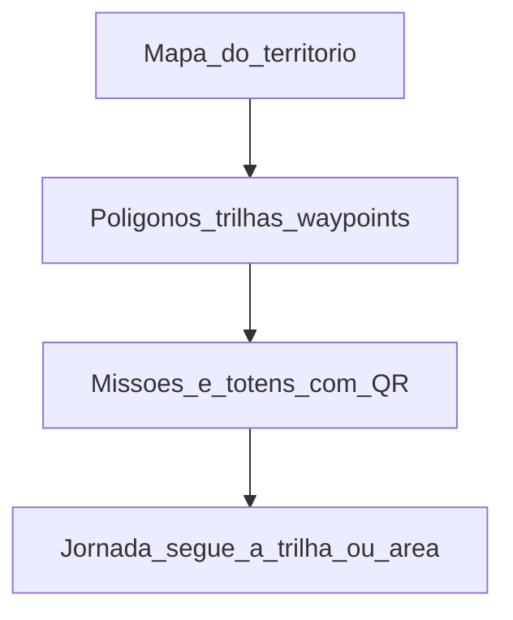
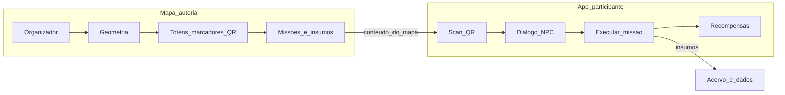
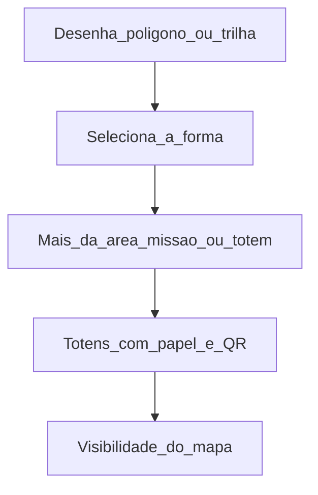
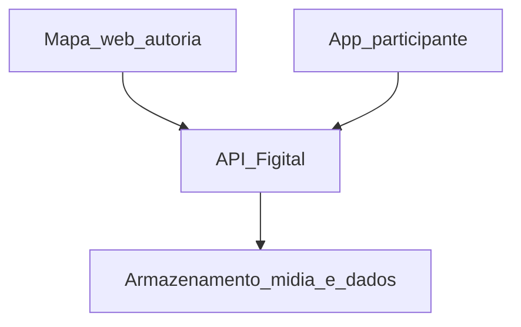

# Figital — Regras de Negócio, Casos de Uso e Especificação Técnica

**Plataforma:** Território (territorio.ai)
**Tipo:** Interações físico-digitais sobre o mapa do território
**Versão do documento:** 2.1
**Data:** 14/09/2026
**Escopo:** Produto planejado — não descreve o estado atual da POC

> A interface que existe hoje está em [`DOCUMENTACAO_ATUAL.md`](DOCUMENTACAO_ATUAL.md). Este arquivo descreve como o Figital opera no mapa: geometria, totens, jornada no campo e divisão entre **mapa** (autoria) e **aplicativo** (participação). Não trate `Documentacao_Regras_de_Negocio_Mapa.md` nem este arquivo como estado atual.

---

## Sumário

**Parte 1 — Negócio**

1. [Como funciona](#1-como-funciona)
2. [Papéis](#2-papéis)
3. [Objetos de negócio](#3-objetos-de-negócio)
4. [Como adicionar interações Figital](#4-como-adicionar-interações-figital)
5. [Fluxo principal](#5-fluxo-principal)
6. [Regras de negócio](#6-regras-de-negócio)
7. [Casos de uso](#7-casos-de-uso)
8. [Roteiro: Serra do Vulcão](#8-roteiro-serra-do-vulcão)
9. [Matriz de permissões](#9-matriz-de-permissões)

**Parte 2 — Técnica**

10. [Dois produtos, um contrato](#10-dois-produtos-um-contrato)
11. [Mapa — autoria e operação](#11-mapa--autoria-e-operação)
12. [Aplicativo — jornada do participante](#12-aplicativo--jornada-do-participante)
13. [Arquitetura e API conceitual](#13-arquitetura-e-api-conceitual)
14. [QR, NPC e offline](#14-qr-npc-e-offline)
15. [Schema de insumos](#15-schema-de-insumos)
16. [Dados gerados para a instituição](#16-dados-gerados-para-a-instituição)
17. [Glossário](#17-glossário)
18. [Questões em aberto](#18-questões-em-aberto)

---

# Parte 1 — Negócio, fluxo e regras

## 1. Como funciona

No Território, o Figital acontece **no mapa**. A instituição cria o mapa do território, demarca polígonos, trilhas e waypoints e, **dentro dessa geometria**, coloca as interações de campo: missões e totens (marcadores com QR). A pessoa participa no território: chega a um totem, escaneia o QR, conversa com o NPC, cumpre missões e deixa insumos. Esses insumos voltam para a instituição como acervo e evidência da ação comunitária.

São duas superfícies com o mesmo conteúdo. No **mapa web**, a instituição desenha e configura. No **aplicativo**, a pessoa percorre a trilha.



### 1.1. O que o Figital usa do mapa

Missões, mutirões, memórias, linhas e polígonos continuam como estão. O Figital aproveita esses elementos e acrescenta a jornada presencial:

| No mapa | No Figital |
|---------|------------|
| Mapa (repositório, visibilidade público/privado) | Onde a instituição organiza o território e quem pode ver ou participar |
| Polígono / trilha (linha) | Percurso: a trilha ou área pela qual a pessoa caminha, com progresso e recompensa final |
| Missão com localização | Missão de totem, com NPC, ordem e insumos configuráveis |
| Marcador | Totem: o mesmo marcador, com QR, papel na trilha e roteiro do NPC |
| Memória | Um dos tipos possíveis de insumo |
| Estrelas / insígnias (planejadas) | Recompensa parcial por totem e recompensa final do percurso |

### 1.2. Fluxo em uma imagem



---

## 2. Papéis

| Papel | Onde atua | Descrição |
|-------|-----------|-----------|
| **Organizador** | Mapa | Owner ou Editor do mapa. Desenha a geometria, posiciona totens, lê os insumos. |
| **Operador de campo** | Mapa (leitura) e território físico | Instala totens e testa QRs. Só altera geometria ou regras do percurso se também for Editor. |
| **Participante** | Aplicativo | Pessoa na trilha. Não precisa ser colaboradora do mapa. Começa a jornada no QR do totem de entrada daquele percurso. |
| **NPC** | Aplicativo | Persona guiada (texto, áudio ou avatar). Não é um usuário. Explica a missão, a recompensa e o próximo passo. |

> [!IMPORTANT]
> Quem edita o mapa não é, automaticamente, quem caminha a trilha. Quem caminha a trilha não ganha permissão de editar o mapa.

---

## 3. Objetos de negócio

### 3.1. Mapa do território

O mapa guarda o nome, a visibilidade (público ou privado, no produto planejado), a geometria e as interações. Quem tem acesso ao mapa vê, conforme a permissão, as trilhas, os totens e as missões.

A visibilidade e o arquivamento são do mapa. Um percurso (trilha ou área com totens) pode ficar **ativo** ou **inativo** sem arquivar o mapa inteiro ([RN-FIG-007](#61-mapa-geometria-e-percurso)).

### 3.2. Geometria

Polígono, linha (trilha) e waypoint desenháveis no mapa. Missões e totens ficam **dentro** dessa geometria — ou sobre a linha, no caso de trilha.

### 3.3. Percurso (trilha ou área com totens)

É a unidade da jornada. Quando uma trilha ou um polígono recebe totens, vira um percurso: tem modo de progresso (`sequencial` ou `livre`), recompensa final, texto de consentimento dos insumos e, se a instituição quiser, um período (início e fim).

Se o mesmo mapa tiver a Serra do Vulcão e outra trilha, cada uma é um percurso. A pessoa caminha um percurso de cada vez.

### 3.4. Totem

Marcador do mapa com os campos da jornada de campo. Cada totem tem:

- Coordenada (as mesmas regras de posicionamento do marcador)
- Papel: `inicio`, `intermediario` ou `fim`
- QR (URL profunda do app)
- Missão associada (obrigatória nos intermediários e no fim; o de início pode só abrir a jornada)
- Roteiro do NPC naquele ponto

O totem fica na trilha, na área ou ligado a uma missão daquela geometria.

### 3.5. Missão de totem

Missão do mapa com os campos da jornada: instrução do NPC, ordem, recompensa parcial e **catálogo de insumos** (quais evidências a pessoa deve entregar). Uma missão pode pedir um ou mais tipos de insumo.

### 3.6. Jornada

Sessão de um participante num percurso, criada no scan do totem de **início** daquela trilha ou área. Guarda progresso, rascunhos offline e recompensas já liberadas.

Status da jornada:

```
INICIADA ──► EM_ANDAMENTO ──► CONCLUIDA
     │              │
     └──────────────┴──► ABANDONADA (inatividade, percurso inativo ou mapa arquivado)
```

### 3.7. Recompensa

- **Parcial:** ao concluir a missão daquele totem (insígnia pequena, XP, item de coleção).
- **Final:** ao concluir todas as missões **obrigatórias** daquele percurso. As parciais não substituem a final.

### 3.8. Insumo

Evidência gerada na missão. Os tipos não são iguais em todo o percurso: cada missão escolhe no catálogo (foto, vídeo, áudio, texto, GPS/check-in, formulário, memória no mapa). Ver [§15](#15-schema-de-insumos).

---

## 4. Como adicionar interações Figital

Pergunta prática: *quero a Serra do Vulcão no mapa, com totens e QR — como faço?* Desenha a geometria e usa o **“+” da forma**, o mesmo fluxo que o mapa já tem para colocar missão ou marcador dentro da área.

### 4.1. Onde fica o gatilho

Ao selecionar um polígono ou uma trilha, o mapa mostra as ações da forma no canto (adicionar dentro, editar, excluir — ver [`poc/client/index.html`](../poc/client/index.html), bloco `shape-actions`). O Figital usa esse **“+”**: além de missão e marcador, o organizador posiciona **totem** (marcador com QR), sempre **dentro** da geometria.

A trilha ou área vira percurso quando o primeiro totem entra. O totem com papel `inicio` é o ponto em que a jornada do participante começa.

### 4.2. Caminho — geometria primeiro (o da Serra do Vulcão)



1. Owner ou Editor desenha o polígono ou a trilha **Serra do Vulcão** (ou seleciona uma geometria que já existe).
2. Nas ações da forma, o **“+”** oferece **Missão** e **Totem**, sempre dentro da geometria.
3. O totem com papel `inicio` marca o começo da jornada; intermediários e fim vêm na sequência.
4. Em cada totem: missão, insumos, roteiro do NPC, recompensa parcial.
5. No percurso: modo de progresso, recompensa final, texto de consentimento.
6. Gera as artes de QR. Quem vê o mapa e quem pode iniciar a jornada depende da **visibilidade do mapa** e de o percurso estar ativo.

### 4.3. Totem ligado a uma missão

O “+” também posiciona missão dentro da área, como hoje. Um totem pode ficar sobre a trilha ou associado a uma missão já criada naquela geometria. Nos dois casos é o mesmo marcador; muda só o vínculo.

### 4.4. Se a geometria ainda não existe

Desenha o polígono ou a trilha e segue o [§4.2](#42-caminho--geometria-primeiro-o-da-serra-do-vulcão). A geometria vem primeiro; as interações entram nela.

---

## 5. Fluxo principal

### 5.1. Lado da instituição (mapa)

1. Cria ou abre o mapa do território.
2. Demarca a área ou a trilha (ex.: Serra do Vulcão).
3. Pelo **“+” da forma**, posiciona totens dentro da geometria e define início, intermediários e fim.
4. Em cada totem: missão, insumos, roteiro do NPC, recompensa parcial.
5. No percurso: modo de progresso, recompensa final e texto de consentimento.
6. Gera as artes de QR e instala os totens físicos. Quem participa depende da visibilidade do mapa.

### 5.2. Lado da pessoa (aplicativo)

1. Chega ao totem de início daquele percurso e escaneia o QR.
2. Aceita o consentimento dos insumos, se ainda não tiver aceito neste mapa.
3. O NPC apresenta a trilha, as missões e a recompensa final daquele percurso.
4. Em cada totem seguinte: scan (QR obrigatório), NPC daquele ponto, execução da missão, envio do insumo, recompensa parcial.
5. No totem de fim (ou ao completar a última missão obrigatória do percurso): recompensa final.
6. Os insumos ficam no painel do mapa / daquele percurso, para a instituição.

---

## 6. Regras de negócio

### 6.1. Mapa, geometria e percurso

| Regra | Descrição |
|-------|-----------|
| **RN-FIG-001** | Interações Figital (missões e totens) vivem **no mapa do território**: a instituição desenha a geometria e coloca as interações dentro dela |
| **RN-FIG-002** | Cada missão ou totem Figital pertence a **exatamente uma geometria** (polígono ou trilha) daquele mapa |
| **RN-FIG-003** | Só **Owner** e **Editor** do mapa criam, editam ou desativam geometria e interações Figital |
| **RN-FIG-004** | Um percurso tem obrigatoriamente **geometria** e **modo de progresso**. Período, recompensa final e texto de consentimento podem ser preenchidos até o primeiro totem `inicio` receber jornada |
| **RN-FIG-005** | Totem é um **marcador** do mapa com QR, papel (`inicio` / `intermediario` / `fim`), missão e roteiro do NPC |
| **RN-FIG-006** | Em mapa **privado** ou percurso **inativo**, o participante não inicia jornada; QRs de teste só funcionam para Owner/Editor |
| **RN-FIG-007** | Mapa **arquivado** ou percurso **inativo** não inicia jornada nova; jornadas em andamento passam a `ABANDONADA` |
| **RN-FIG-008** | Um mapa pode ter **vários** percursos. A jornada é **por percurso** |
| **RN-FIG-041** | Totens entram pelo **“+” da área/trilha**, dentro da geometria — não pelo “Novo marcador” solto no mapa, para não cair fora do território |
| **RN-FIG-042** | Jornada, modo de progresso, recompensa final e consentimento daquele percurso pertencem à **trilha ou área** que contém os totens |

### 6.2. Totens e QR

| Regra | Descrição |
|-------|-----------|
| **RN-FIG-009** | Todo percurso com jornada tem **exatamente um** totem com papel `inicio` |
| **RN-FIG-010** | Todo percurso com jornada tem **pelo menos um** totem que não seja só de início (intermediário e/ou fim) |
| **RN-FIG-011** | Totens ficam **dentro** da geometria do percurso (ou sobre a trilha, com tolerância de posicionamento) |
| **RN-FIG-012** | Cada totem tem um QR único, apontando para URL profunda do app daquele mapa, daquele percurso e daquele totem |
| **RN-FIG-013** | A jornada começa no QR do totem `inicio` daquele percurso |
| **RN-FIG-014** | QR de totem intermediário ou de fim **sem jornada** não executa missão: informa que é preciso começar no totem inicial (e, se o GPS permitir, indica a direção) |
| **RN-FIG-015** | Check-in no totem exige **scan do QR**. GPS é validação **opcional** por missão (trilha com sinal fraco não pode bloquear o piloto) |
| **RN-FIG-016** | QRs levam payload **assinado** para reduzir totens falsos (impressos por terceiros) |

### 6.3. Missões e progresso

| Regra | Descrição |
|-------|-----------|
| **RN-FIG-017** | O modo de progresso é **sequencial** ou **livre**, definido no percurso. O exemplo Serra do Vulcão usa **sequencial** |
| **RN-FIG-018** | Em modo sequencial, a missão N só abre depois da missão N−1 **obrigatória** concluída |
| **RN-FIG-019** | Missões podem ser **obrigatórias** ou **opcionais**. Só as obrigatórias contam para a recompensa final do percurso |
| **RN-FIG-020** | Concluir uma missão exige entregar **todos** os insumos obrigatórios daquela missão, com a validação mínima de cada tipo |
| **RN-FIG-021** | Uma missão de totem pertence a **exatamente um totem** |
| **RN-FIG-022** | Owner/Editor podem alterar conteúdo de missão com o mapa visível; jornadas já passadas daquele totem **não são reabertas** |

### 6.4. Jornada do participante

| Regra | Descrição |
|-------|-----------|
| **RN-FIG-023** | Um participante tem **no máximo uma jornada ativa** por percurso |
| **RN-FIG-024** | Recomeçar o mesmo percurso só é permitido se o percurso estiver ativo, o mapa permitir participação, a jornada anterior estiver `CONCLUIDA` ou `ABANDONADA` e o organizador **permitir replay** |
| **RN-FIG-025** | No piloto, a identidade pode ser **conta Território** ou **jornada anônima** (ver [§18](#18-questões-em-aberto)). Anônimo ainda gera um identificador de dispositivo/sessão para progresso e anti-abuso |
| **RN-FIG-026** | Sem rede, o app guarda rascunho local (progresso + insumos) e envia ao reconectar |
| **RN-FIG-027** | Jornada sem atividade pelo prazo configurado pelo organizador (padrão **7 dias**) pode ser marcada `ABANDONADA` |

### 6.5. Recompensas

| Regra | Descrição |
|-------|-----------|
| **RN-FIG-028** | Recompensa **parcial** é liberada quando a missão daquele totem é concluída (insumos validados ou aceitos na fila offline) |
| **RN-FIG-029** | Recompensa **final** só é liberada com **todas as missões obrigatórias daquele percurso** concluídas |
| **RN-FIG-030** | O conjunto das parciais **não substitui** a recompensa final |
| **RN-FIG-031** | Recompensas são da **jornada/participante**, não do mapa. Podem aparecer depois como insígnia de perfil, se a plataforma de insígnias estiver ativa |

### 6.6. Insumos, consentimento e uso

| Regra | Descrição |
|-------|-----------|
| **RN-FIG-032** | Os tipos de insumo são um **catálogo**. Cada missão escolhe quais usa e quais são obrigatórios |
| **RN-FIG-033** | Antes do primeiro envio de insumo **neste mapa**, o participante vê a finalidade e aceita (pesquisa, acervo interno, publicação no mapa) |
| **RN-FIG-034** | Recusar o consentimento **impede iniciar** a jornada se o percurso coleta qualquer insumo pessoal |
| **RN-FIG-035** | Insumo com visibilidade `mapa_publico` vira memória (ou elemento equivalente) no mapa, sujeito à moderação do organizador se essa opção estiver ligada |
| **RN-FIG-036** | Insumo com visibilidade `interno` só aparece no painel da instituição |
| **RN-FIG-037** | O participante pode solicitar exclusão dos próprios insumos; o organizador cumpre o pedido no prazo legal vigente (detalhe jurídico em aberto) |

### 6.7. Escopo e limites

O que o piloto assume de propósito:

| Regra | Descrição |
|-------|-----------|
| **RN-FIG-045** | A trilha se completa **no território**: sem check-in por scan de QR, a missão não fecha (GPS é reforço opcional, [RN-FIG-015](#62-totens-e-qr)) |
| **RN-FIG-046** | Autoria (mapa, geometria, totens, missões) é no mapa web. O app serve à jornada no campo |
| **RN-FIG-047** | No piloto o NPC é um **roteiro fixo por totem**. IA generativa fica como evolução (ver [§14.2](#142-npc-piloto)) |

### 6.8. Relação com missões e memórias do mapa

| Regra | Descrição |
|-------|-----------|
| **RN-FIG-038** | Missão de totem é uma missão do mapa, com os campos extras da jornada (NPC, ordem, insumos) |
| **RN-FIG-039** | Mutirão não é obrigatório no Figital. Pode ser vinculado depois (ex.: mutirão de plantio no fim da trilha) — fora do MVP Figital |
| **RN-FIG-040** | Memória pode ser um tipo de insumo; se escolhida, herda a geolocalização do totem |

---

## 7. Casos de uso

### UC-01 — Adicionar totem ou missão Figital à geometria

| | |
|--|--|
| **Ator** | Organizador (Owner/Editor) |
| **Pré-condição** | Mapa existente; polígono ou trilha desenhado (ou a desenhar) |
| **Fluxo** | Desenha ou seleciona a forma → no **“+” da área**, escolhe **Totem** ou **Missão** → posiciona **dentro** da geometria → no totem: papel, missão, insumos, NPC → gera QR |
| **Pós-condição** | Totem e/ou missão na geometria; URL profunda e arte de QR quando for totem |
| **Exceções** | Ponto fora da geometria ([RN-FIG-011](#62-totens-e-qr)); usuário sem papel Owner/Editor não vê o “+” de totem ([RN-FIG-003](#61-mapa-geometria-e-percurso)) |

### UC-02 — Configurar totem, QR e missão

| | |
|--|--|
| **Ator** | Organizador |
| **Pré-condição** | Geometria existente; percurso ativo ou ainda sem totens |
| **Fluxo** | Pelo **“+” da área**, posiciona totem dentro da geometria → papel (início/intermediário/fim) → missão, insumos, NPC, recompensa parcial → gera QR |
| **Pós-condição** | Totem com URL profunda e arte de QR para download |
| **Exceções** | Ponto fora do território; percurso sem totem de início quando a primeira jornada for permitida |

### UC-03 — Visibilidade do mapa e percurso ativo/inativo

| | |
|--|--|
| **Ator** | Organizador |
| **Pré-condição** | Mapa existente |
| **Fluxo** | Mapa **público** permite que participantes vejam a geometria e iniciem jornada nos percursos **ativos** (com RN-FIG-009 e RN-FIG-010 atendidos). Mapa **privado** restringe a colaboradores. **Arquivar** o mapa ou **desativar** um percurso impede jornadas novas e abandona as abertas daquele escopo |
| **Pós-condição** | Visibilidade do mapa atualizada e/ou percurso ativo/inativo |
| **Exceções** | Percurso ativo sem totem de início: jornada de participante não abre (Owner/Editor ainda testam) |

### UC-04 — Iniciar jornada no totem inicial

| | |
|--|--|
| **Ator** | Participante |
| **Pré-condição** | Mapa visível para participação; percurso ativo; totem físico instalado |
| **Fluxo** | Scan do QR de início → consentimento (se ainda não houver neste mapa) → NPC de abertura → jornada `INICIADA` naquele percurso |
| **Pós-condição** | Jornada ativa; progresso 0 |
| **Exceções** | Mapa privado / arquivado ou percurso inativo; já existe jornada ativa naquele percurso (abre a existente); QR inválido/assinatura falhou |

### UC-05 — Completar missão e enviar insumo

| | |
|--|--|
| **Ator** | Participante |
| **Pré-condição** | Jornada em andamento; no modo sequencial, missão anterior obrigatória concluída |
| **Fluxo** | Scan do totem → NPC explica a missão → captura dos insumos → validação mínima → envio (ou fila offline) → missão concluída |
| **Pós-condição** | Insumos registrados; recompensa parcial elegível |
| **Exceções** | Insumo obrigatório faltando; GPS exigido e fora da tolerância; totem fora de ordem (sequencial) |

### UC-06 — Receber recompensa parcial e final

| | |
|--|--|
| **Ator** | Participante |
| **Pré-condição** | UC-05 para parcial; todas as obrigatórias **do percurso** para a final |
| **Fluxo** | App mostra a recompensa e atualiza a carteira. No fim da trilha, o NPC entrega a recompensa maior |
| **Pós-condição** | Parcial e/ou final na jornada |
| **Exceções** | Envio ainda só na fila offline: parcial pode ficar “pendente de sincronizar” |

### UC-07 — Consultar acervo e insumos

| | |
|--|--|
| **Ator** | Organizador |
| **Pré-condição** | Mapa com pelo menos um percurso (qualquer estado) |
| **Fluxo** | Abre o painel do mapa / do percurso → lista participantes/jornadas, insumos por totem, indicadores, exportação |
| **Pós-condição** | Leitura; exportação gera arquivo (CSV/GeoJSON) |
| **Exceções** | Participante anônimo aparece como código, não como nome |

### UC-08 — QR de totem intermediário sem jornada

| | |
|--|--|
| **Ator** | Participante (ou visitante) |
| **Pré-condição** | Scan de totem que não é `inicio`, sem jornada ativa naquele percurso |
| **Fluxo** | O app não abre a missão. O NPC (ou mensagem equivalente) pede para ir ao totem de início. Se houver GPS, mostra o ponto de partida no mapa simplificado |
| **Pós-condição** | Nenhuma jornada criada |
| **Exceções** | Owner/Editor em modo teste podem simular o totem |

### UC-09 — Sinal ruim / retomar jornada

| | |
|--|--|
| **Ator** | Participante |
| **Pré-condição** | Jornada já iniciada; rede instável ou ausente |
| **Fluxo** | Progresso e mídia ficam no aparelho. Scan de QR continua funcionando se o app já tiver o manifesto do **percurso** em cache. Ao reconectar, a fila envia insumos e confirma recompensas pendentes |
| **Pós-condição** | Jornada retomada no mesmo ponto; insumos eventualmente no servidor |
| **Exceções** | Primeiro scan (início) **sem** manifesto em cache e **sem** rede: pedir para aproximar de cobertura ou baixar o app/percurso antes da trilha |

### UC-10 — Participação de menor

| | |
|--|--|
| **Ator** | Participante menor e responsável |
| **Pré-condição** | **Não fechado pela instituição** |
| **Fluxo provisório** | Se o percurso marcar “permite menor”, o consentimento deve ser do responsável. Sem essa marcação, o piloto assume participante capaz de consentir |
| **Pós-condição** | Em aberto — ver [§18](#18-questões-em-aberto) |
| **Exceções** | Percurso escolar / mutirão infantil exige definição jurídica antes de abrir jornada ao público |

---

## 8. Roteiro: Serra do Vulcão

Trilha piloto **sequencial** na Baixada Fluminense, dentro de um mapa do território. O percurso é a linha ou o polígono da trilha. Cinco totens sobre essa geometria.

### 8.1. Passo a passo da autoria

1. No mapa, desenha (ou seleciona) o polígono/trilha **Serra do Vulcão**.
2. Pelo **“+” da forma**, posiciona os cinco totens: `inicio` na porta da trilha, três `intermediario`, um `fim` no mirante.
3. Em cada totem, escreve o roteiro do NPC, escolhe os insumos e a recompensa parcial (tabela abaixo).
4. No percurso: modo sequencial, insígnia final e texto de consentimento.
5. Baixa as artes de QR de cada totem para impressão. A visibilidade continua sendo a do mapa.

### 8.2. Roteiro dos totens

| Ordem | Totem | Papel | Missão (NPC) | Insumos (exemplo) | Recompensa |
|-------|-------|-------|----------------|-------------------|------------|
| 1 | Porta da trilha | `inicio` | “Eu sou a Guardiã da Serra. Cinco paradas, uma história. No fim, a insígnia da trilha.” | Consentimento; nenhum insumo de campo | — |
| 2 | Mirante do vale | `intermediario` | “Fotografe o vale e diga, numa frase, o que mudou na paisagem.” | Foto + texto curto | Insígnia *Olhar da Serra* |
| 3 | Nascente | `intermediario` | “Registre o nível da água e se há lixo no entorno.” | Formulário (nível: baixo/médio/alto; lixo: sim/não) + foto opcional | Insígnia *Guardião da Nascente* |
| 4 | Trecho de mata | `intermediario` | “Grave 15 segundos de som da mata — ou descreva o que escuta.” | Áudio **ou** texto (um dos dois obrigatório) | Insígnia *Escuta Viva* |
| 5 | Mirante final | `fim` | “Você fechou a trilha. Deixe uma memória para quem vier depois.” | Memória (foto + legenda) visível no mapa | **Insígnia Serra do Vulcão** (final) + parciais já ganhas |

Recompensa final só após totens 2, 3, 4 e 5 (todos obrigatórios neste roteiro). O totem 1 não tem missão de insumo.

Este roteiro é ilustrativo. Outra trilha no mesmo mapa pode usar só GPS, só formulário, ou só memória — o catálogo é por missão.

---

## 9. Matriz de permissões

### 9.1. Mapa (autoria)

| Ação | Participante | Visualizador do mapa | Editor | Owner |
|------|--------------|----------------------|--------|-------|
| Ver geometria e totens no mapa | Sim* | Sim | Sim | Sim |
| Desenhar polígono / trilha | Não | Não | Sim | Sim |
| Adicionar missão ou totem pelo “+” da forma | Não | Não | Sim | Sim |
| Gerar QR do totem | Não | Não | Sim | Sim |
| Alterar visibilidade / arquivar mapa; ativar ou desativar percurso | Não | Não | Sim | Sim |
| Ver insumos internos | Não | Não | Sim | Sim |
| Exportar insumos | Não | Não | Sim | Sim |

\* No mapa web público, o participante vê a área e os totens se o mapa for visível; não vê insumos internos.

### 9.2. Aplicativo (jornada)

| Ação | Sem jornada | Jornada ativa | Owner/Editor (teste) |
|------|-------------|---------------|----------------------|
| Iniciar no QR de início | Sim, se mapa visível e percurso ativo | Retoma a existente daquele percurso | Sim, inclusive mapa privado / percurso inativo |
| Executar missão em totem intermediário | Não (UC-08) | Sim, se a ordem permitir | Sim |
| Enviar insumo | Não | Sim | Sim |
| Ver carteira de recompensas | Não | Sim | Sim |

---

# Parte 2 — Técnica: mapa vs aplicativo

## 10. Dois produtos, um contrato

| Superfície | Função | Público | Dispositivo típico |
|------------|--------|---------|-------------------|
| **Mapa (web)** | Autoria: geometria, totens, missões, QRs, painel de insumos | Instituição | Desktop / tablet |
| **App do participante** | Presença: QR, NPC, câmera, GPS, fila offline, recompensas | Pessoa na trilha | Celular |

O participante não cria mapa nem totens no app. O organizador não cumpre a trilha no mapa web (pode testar QRs).

O contrato comum é a **API Figital** do mapa: geometria, totens, missões, jornada por percurso, insumos, recompensas.

O que a POC do mapa já oferece e o Figital reaproveita:

- Desenho de polígono e linha ([`poc/client/src/app.js`](../poc/client/src/app.js))
- Ações da forma selecionada (adicionar dentro, editar, excluir) — o **“+”** passa a oferecer **Totem** além de missão/marcador ([§4.1](#41-onde-fica-o-gatilho))
- Posicionar missão ou marcador **dentro** de uma área
- Memória ligada a missão/marcador (foto + comentário, só no cliente hoje)

O que entra de novo: campos Figital no marcador (QR, papel, NPC), ficha do percurso (modo, recompensa final, consentimento), jornada, recompensas, app, persistência e insumos configuráveis.

---

## 11. Mapa — autoria e operação

### 11.1. Features a acrescentar na web

1. **“+” da forma** com **Totem**, posicionando só dentro da geometria ([§4](#4-como-adicionar-interações-figital)).
2. **Ficha do totem:** papel início / intermediário / fim, QR, missão, insumos, validação (ex.: GPS opcional, raio em metros), recompensa parcial, roteiro do NPC (falas).
3. **Ficha do percurso** (a trilha/área selecionada, quando já tem totens): modo de progresso, recompensa final, consentimento, ativo/inativo.
4. **Gerar e baixar arte de QR** por totem (PNG/PDF com nome do totem e do mapa/percurso).
5. **Visibilidade do mapa** e ativar/desativar percurso.
6. **Painel do mapa / percurso:** jornadas, taxa de conclusão, insumos por totem, moderação de memórias públicas, exportação CSV/GeoJSON.

### 11.2. Telas (mapa)

| Tela | Conteúdo |
|------|----------|
| Mapa com geometria selecionada | Ações da forma: **+** (missão, totem), editar, excluir |
| Editor de totem | Pino no mapa (marcador), papel, QR, missão, NPC, insumos |
| Ficha do percurso | Dados da trilha/área: modo, recompensa final, consentimento, ativo/inativo |
| Preview do NPC | Lê o roteiro como o app vai mostrar (sem substituir o teste no celular) |
| Painel de dados | Indicadores + lista de insumos + exportar |
| Moderar memórias | Fila do que foi marcado `mapa_publico` |

### 11.3. Fora do mapa

Instalação física dos totens, impressão e material de campo não são software. O mapa entrega a arte do QR e as coordenadas.

---

## 12. Aplicativo — jornada do participante

### 12.1. Telas

| Tela | Comportamento |
|------|----------------|
| Scan / deep link | Câmera de QR ou abertura pela URL `https://…/m/{mapa}/t/{totem}` |
| Consentimento | Finalidades dos insumos deste mapa; aceitar ou sair |
| Cena do NPC | Roteiro do totem atual (texto; áudio opcional). Sem chatbot livre no piloto |
| Mapa da trilha | Totens, progresso, próximo ponto. Simplificado; não é o editor do mapa web |
| Execução da missão | Blocos conforme o schema: câmera, áudio, texto, formulário, check-in |
| Fila offline | “Guardado no celular — envia quando houver rede” |
| Carteira / progresso | Parciais, falta quanto para a final deste percurso |
| Jornada concluída | Recompensa final + convite a ver a memória no mapa (se pública) |

### 12.2. O que o app não tem

- Criar ou editar mapa, geometria, totens, missões
- Painel de insumos da instituição
- Ferramentas de desenho de polígono

### 12.3. Recomendação de forma do app (piloto)

| Opção | Quando faz sentido | Risco na trilha |
|-------|--------------------|-----------------|
| **PWA** (recomendado no piloto) | Entrega rápida; QR abre no navegador; fallback de link se não instalar | Câmera, QR e cache offline variam por celular |
| **Nativo** | Se o piloto falhar em câmera, QR ou offline no campo | Custo e lojas |

Recomendação deste documento: **piloto em PWA com fallback de link**. Avaliar nativo depois de uma trilha real (Serra do Vulcão ou equivalente).

---

## 13. Arquitetura e API conceitual



### 13.1. Recursos (nível de especificação)

Não é implementação. Nomes ilustram o contrato, no escopo de **mapa** e **percurso** (trilha/área).

| Recurso | Uso principal |
|---------|----------------|
| `GET/POST /mapas/{id}/percursos` | Percurso (geometria + modo + recompensa final) |
| `GET/POST /mapas/{id}/totens` | Totens (marcadores Figital) |
| `PATCH /mapas/{id}/percursos/{id}` | Ativar/desativar; modo; consentimento |
| `GET /mapas/{id}/percursos/{id}/manifest` | Pacote do percurso para o app (totens, missões, NPC, schema de insumos) — cacheável offline |
| `POST /jornadas` | Início no totem `inicio` daquele percurso |
| `GET /jornadas/{id}` | Progresso |
| `POST /jornadas/{id}/checkins` | Scan de totem |
| `POST /jornadas/{id}/insumos` | Envio (ou sincronização da fila) |
| `POST /jornadas/{id}/missoes/{id}/concluir` | Fecha missão se insumos obrigatórios ok |
| `GET /mapas/{id}/insumos` | Painel da instituição (filtrável por percurso) |
| `GET /mapas/{id}/export` | CSV / GeoJSON |

Mídia (foto, vídeo, áudio) sobe para armazenamento de objetos; a API guarda metadados e URL.

### 13.2. Identidade (decisão em aberto)

| Modelo | Prós | Contras |
|--------|------|---------|
| Conta Território | Recompensas no perfil; menos abuso | Fricção no início da trilha |
| Jornada anônima + ID de dispositivo | Começa no QR em segundos | Dificulta insígnia de perfil e recuperação entre aparelhos |
| Híbrido (recomendado no piloto) | Começa anônimo; oferecer “salvar na conta” no fim | Dois estados para suportar |

---

## 14. QR, NPC e offline

### 14.1. QR

Formato da URL:

```
https://{dominio-app}/m/{mapaId}/t/{totemId}?s={assinatura}
```

- `mapaId` e `totemId` identificam o ponto; o percurso é o da geometria daquele totem.
- `s` é HMAC (ou equivalente) com segredo do servidor, para dificultar QR falso.
- O app valida a assinatura **online**. Offline, aceita se o manifesto em cache já contém aquele totem (totem conhecido do percurso baixado).

### 14.2. NPC (piloto)

Roteiro por totem em JSON no manifesto, por exemplo:

```json
{
  "totemId": "t2",
  "npc": {
    "nome": "Guardiã da Serra",
    "falas": [
      { "id": "intro", "texto": "Aqui o vale se abre. Olhe com calma." },
      { "id": "missao", "texto": "Tire uma foto e escreva uma frase sobre a paisagem." },
      { "id": "ok", "texto": "Isso. Sua olhada ficou no mapa." }
    ]
  }
}
```

Sem modelo de linguagem no piloto. IA generativa fica como evolução (custo, rede, tom da instituição).

### 14.3. Offline

1. Depois do **primeiro** `manifest` do **percurso** baixado (idealmente no totem de início com rede, ou em casa antes da trilha), totens, falas e schemas ficam no aparelho.
2. Fotos/áudios vão para fila local.
3. Conclusão de missão pode ser **otimista** no aparelho; o servidor confirma na sincronização.
4. Recompensa final só fica **confirmada** no servidor quando os insumos obrigatórios chegarem. A UI pode mostrar “quase lá — falta enviar”.

UC-09 cobre o caso de chegar ao totem 1 **sem** manifesto e **sem** rede: não dá para improvisar o percurso inteiro.

---

## 15. Schema de insumos

Catálogo configurável por missão. Cada item:

| Campo | Significado |
|-------|-------------|
| `tipo` | `foto` \| `video` \| `audio` \| `texto` \| `gps` \| `formulario` \| `memoria` |
| `obrigatorio` | Se a missão não fecha sem este item |
| `validacao` | Regras mínimas (ver abaixo) |
| `visibilidade` | `interno` \| `mapa_publico` |
| `rotulo` | Texto no app (“Foto do vale”) |

Validações mínimas sugeridas:

| Tipo | Validação mínima |
|------|------------------|
| `foto` | Arquivo de imagem presente; tamanho máximo definido no mapa/percurso |
| `video` | Duração máxima (ex.: 30 s) |
| `audio` | Duração máxima (ex.: 30 s) |
| `texto` | Comprimento mín/máx |
| `gps` | Opcional; se ligado, distância máxima ao totem (ex.: 80 m). Se sem sinal, o organizador pode marcar `gps.obrigatorio: false` |
| `formulario` | Campos (enum, número, sim/não) todos os `required` preenchidos |
| `memoria` | Foto ou texto + legenda; herda coordenada do totem |

Uma missão pode ter **vários** itens. Pode usar “um dos dois obrigatório” via grupo (`grupoId` + `minimoGrupo: 1`), como no totem 4 da Serra do Vulcão (áudio **ou** texto).

---

## 16. Dados gerados para a instituição

### 16.1. Eventos

| Evento | Quando |
|--------|--------|
| `jornada_iniciada` | QR de início aceito naquele percurso |
| `checkin_totem` | Scan válido de totem |
| `insumo_enviado` | Item aceito (ou sincronizado) |
| `missao_concluida` | Insumos obrigatórios ok |
| `recompensa_parcial` / `recompensa_final` | Liberação |
| `jornada_concluida` / `jornada_abandonada` | Fim da sessão |
| `sync_offline` | Fila despejada |

### 16.2. Metadados de cada insumo

Mapa, percurso, totem, missão, jornada, tipo, horário do aparelho, horário de chegada no servidor, GPS se houver, visibilidade, status de moderação.

### 16.3. Indicadores no painel

- Participantes / jornadas iniciadas (por percurso e no mapa)
- Taxa de conclusão (obrigatórias)
- Tempo médio entre totens e até o fim
- Abandono por totem (onde a fila para)
- Mapa de calor dos check-ins
- Contagem de insumos por tipo

### 16.4. Destinos

| Destino | Uso |
|---------|-----|
| Painel no mapa | Operação dos percursos |
| Acervo de memórias | Insumos `mapa_publico` (após moderação, se houver) |
| Export CSV / GeoJSON | Pesquisa, relatórios, interoperabilidade já prevista no plano antigo do mapa |

---

## 17. Glossário

| Termo | Definição |
|-------|-----------|
| **Mapa do território** | Repositório da geometria e das interações Figital (visibilidade, trilhas, totens, missões) |
| **Geometria** | Polígono, trilha (linha) ou waypoint desenhado no mapa |
| **Percurso** | Trilha ou área com totens: unidade da jornada, do modo de progresso e da recompensa final |
| **Totem** | Marcador do mapa com QR, papel, missão e NPC |
| **NPC** | Persona roteirizada que explica o ponto e a missão |
| **Jornada** | Sessão de um participante num percurso |
| **Insumo** | Evidência configurável gerada na missão |
| **Recompensa parcial** | Ganha ao concluir a missão de um totem |
| **Recompensa final** | Ganha ao concluir todas as missões obrigatórias daquele percurso |
| **Manifesto** | Pacote do percurso baixado pelo app para uso offline |
| **Organizador** | Owner ou Editor do mapa que opera a geometria e as interações |

---

## 18. Questões em aberto

A instituição ainda precisa fechar, fora deste documento de produto:

- **Menor de idade / responsável** (UC-10) — regra jurídica e de consentimento
- **LGPD** na íntegra (base legal, retenção, DPO, termos) — aqui só há o gancho de consentimento por finalidade
- **Identidade:** conta vs. anônimo vs. híbrido ([§13.2](#132-identidade-decisão-em-aberto))
- **Stack mobile definitiva** depois do piloto PWA
- **Impressão e desenho físico dos totens** (materiais, altura, manutenção)
- **Integração com mutirão e calendário** já existentes na plataforma Território
- **Moderação:** automática, fila humana ou publicação imediata das memórias
- **Replay:** uma pessoa pode refazer a Serra do Vulcão na mesma temporada?

---

*Documento gerado em 09/09/2026, atualizado em 14/09/2026 — Versão 2.1*
*Plano de produto Figital. Não altera o que a POC do mapa faz hoje.*
